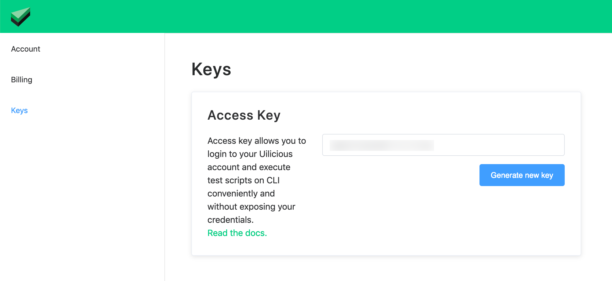

## Intro
Command line interface for Uilicious users to manage their test scripts

## Installation
Before installing this package, please run this to ensure that npm is updated to the latest version:
```
$ npm install npm@latest -g
```

This npm package can be installed by:
```
$ npm install -g uilicious-cli
```

## Commands
The list of commands can be retrieved by:
```
$ uilicious-cli
```

## Options

Name   | Command | Parameters
------ | ------- | ------------------
--user | -u `<parameter>` | Username for authentication
--pass | -p `<parameter>` | Password for authentication
--key  | -k `<parameter>` |	Access key for authentication

Use either `--user` and `--pass` or `--key` for authentication, and not both at the same time.

## Upload Test Files

`upload` a local folder consisting of test file into an existing uilicious project, or creates the project if it does not exist.

```bash
uilicious-cli upload --key <access_key> <project_name> <local_directory> [additional_options]
```
**Additional Options**
+ `--overwrite=false` to disable file overwriting on conflict (enabled by default)

## Download Test Files

`download` a uilicious project into a local folder, overwrite duplicate files on conflict

```bash
uilicious-cli download --key <access_key> <project_name> <local_directory> 
```

## Running a test
```
$ uilicious-cli run  --key <acccess_key> <project_name> <script_path> 
```
* `<project_name>` - Name for the project being tested.
* `<script_path>` - Name of the test script being executed.

**Additional Options**
+ `--overwrite=false` to disable file overwriting on conflict (enabled by default)
+ `--browser <browser_name>` options :  e.g. chrome, firefox, edge, safari, ie11 (default "chrome")
+ `--dataFile <data_file_location>` A file location that contains JSON data object to be supplied into the test script
+ `--dataObject <json_string>` JSON data object to be supplied into the test script
+ `--height <browser_height>` height of browser (default "960")
+ `--width <browser_width>` width of browser (default "1280")
+ `--ngrokParam <ngrok_param_name>` Override url param value for DataObject
+ `--ngrokPort <ngrok_port_no>` Set your localhost port number for ngrok to access it publicly

**Examples:**
```
$ uilicious-cli run "demo" "/login/test 1" --key <acccess_key>
```
* `<project_name>` - demo
* `<script_path>` - /login/test 1
* `<acccess_key>` - EgDwKmJa6Lw4Gxpc4q3p2J

## Getting your access key
Please log in into your Uilicious account and navigate to "User Profile" and click on "Keys".

Alternatively, you can visit (after login) : [https://user.uilicious.com/profile/accessKeys](https://user.uilicious.com/profile/accessKeys)



## Deprecation Notice

Please note that the following varients of the command has been deprecated - if you are still using them, please update to their latest equivalent command as they will be officially dropped in 6 months (approximate).

* `import` : use `upload` instead
* `export` : use `download` instead

Copyright &copy; 2019 Uilicious Private Limited
