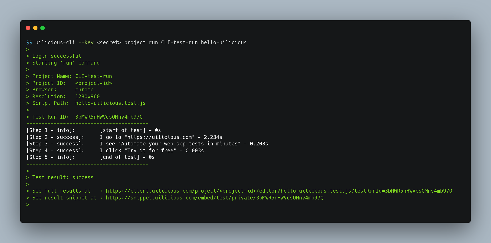
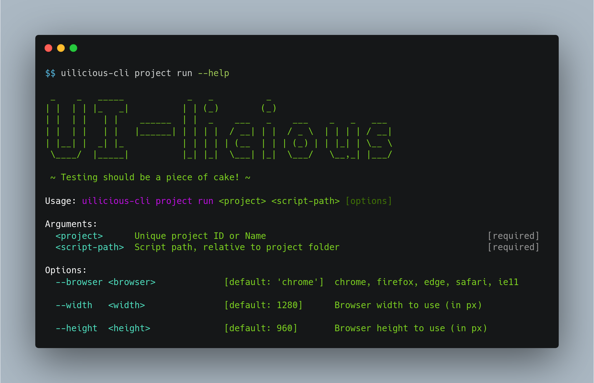

# UI-licious Command Line Interface



[UI-licious](https://uilicious.com) is a tool for development teams to rapidly create and run end-to-end user journey tests for their web applications.

This command line interface allows you to run and manage your UI-licious tests through the command line.

> Note that the UI-licious CLI can only be used with an active subscription of UI-licious.

---

## Installation

The CLI is written in GoLang, and you may install the CLI by downloading the binary distribution or via NPM.

### Download binaries directly
[For Linux or MacOS](https://uilicious.com/downloads/cli/uilicious-cli)
[For Windows](https://uilicious.com/downloads/cli/uilicious-cli.exe)

### Download via npm

Before installing this package, ensure that npm is updated to the latest version:
```
$ npm install npm@latest -g
```

Run the following to install uilicious-cli globally:
```
$ npm install uilicious-cli -g
```

---

## Using `--help`

Use the `--help` option to list the available commands:
```
$ uilicious-cli --help
```


To get more information about a single command, use `--help` after the command:

```
$ uilicious-cli <command> --help
```



---

## Authentication

You can use your access key or username and password to authentication yourself.

### Authentication with access key

> Where can I get my access key?
> Login to UI-licious Studio, go to "[Account and Billing > Access Key](https://user.uilicious.com/profile/accessKeys)"  to view and regenerate your access key

You can set your access key with the `--key` option when using the cli, e.g.:
```
$ uilicious-cli run "demo" "/login/test 1" --key <acccess_key>
```

### Authentication with username and password

Alternative you can authenticate with your username and password, using the `--user` and `--pass` options e.g.
```
$ uilicious-cli run "demo" "/login/test 1" --user <username> --pass <password>
```

You can also use the short form `-u` or `-p`, e.g.:
```
$ uilicious-cli run "demo" "/login/test 1" -u <username> -p <password>
```

---

## Commands

> Warning: Please avoid using deprecated aliases for the commands, as they can be removed in the future.

Name   | **Deprecated** aliases | Purpose
------ | ------- | ------------------
run    | | Run a test
download | export | Download a project to a local directory
upload | import | Upload files from a local directory to a project

---

## Running a test
```
$ uilicious-cli run  <project_name> <script_path> [--browser] [--width] [--height]
```
* `<project_name>` - Name for the project being tested.
* `<script_path>` - Name of the test script being executed.

**Additional Options**
+ `--browser <browser_name>` options :  e.g. chrome, firefox, edge, safari, ie11 (default "chrome")
+ `--height <browser_height>` height of browser (default "960")
+ `--width <browser_width>` width of browser (default "1280")

### Setting the `DATA` object

The `DATA` object is a special object you can use in the test script for dynamic test data.

You can use the `DATA` object in your script like this:
```javascript
// Here's an example to help you get started!
I.goTo("https://github.com")
I.click("Sign up")
I.see("Join GitHub")
I.fill("Username", DATA.username)
I.fill("Email", DATA.email)
I.fill("Password", DATA.password)
I.click("Create an account")
```

You can set the `DATA` using a json string using `--dataObject` or by reading from json file using `--dataFile`.

E.g.
```
$ uilicious-cli run "github" "Login" --dataObject {"username":"brucewayne","password":"secret","email":"bruce@waynecorp.com"}
$ uilicious-cli run "github" "Login" --dataFile "./user-brucewayne.json"
```

### Test local applications using `DATA.url` and ngrok

You can localhost applications using uilicious.

To do so, use the `DATA.url` variable in your test script wherever there's a reference to the url of your application, e.g.
```javascript
I.goTo(DATA.url || "https://mystore.com")
I.click("Sign up")
```

To run your test against your local application, set `--ngrokPort` to the port where your application is hosted, e.g. if your application is hosted on 127.0.0.1:3000:
```
$ uilicious-cli run "MyStore" "Login" --ngrokPort 3000
```

If you use to use another variable instead of `DATA.url`, you can use `--ngrokParam` to set the variable name.

For example if you want the url to be set to `DATA.site`, set `--ngrokParam` to `site`, e.g.
```
$ uilicious-cli run "MyStore" "Login" --ngrokPort 3000 --ngrokParam "site"
```

---

## Upload files to a project

`upload` a local folder consisting of test file into an existing uilicious project, or creates the project if it does not exist.

```bash
uilicious-cli upload <project_name> <local_directory>
```
**Additional Options**
+ `--overwrite=false` to disable file overwriting on conflict (enabled by default)

---

## Download files from a project

`download` a uilicious project into a local folder, overwrite duplicate files on conflict

```bash
uilicious-cli download <project_name> <local_directory>
```

---

## Need help?

Contact [support@uilicious.com](mailto:support@uilicious.com)!

---

Copyright &copy; 2019 Uilicious Private Limited
